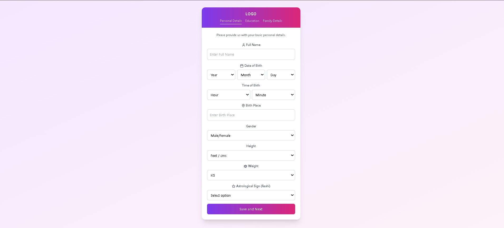

# Personal Details Registration Form - Complete Project by Pathan Afnan Khan


# My Project

Here’s an image:




A professional full-stack registration form with age validation, built with React frontend and choice of Node.js or Django backend.

## Complete Project Structure

```
registration-form-project/
├── README.md  
├── frontend/  
│   ├── public/
│   │   ├── index.html  
│   │   ├── manifest.json   
│   │   └── favicon.ico  
│   ├── src/
│   │   ├── components/
│   │   │   └── RegistrationForm.jsx  
│   │   ├── App.js  
│   │   ├── App.css   
│   │   ├── index.js  
│   │   └── index.css  
│   ├── package.json  
│   ├── tailwind.config.js  
│   └── postcss.config.js   
├── backend-nodejs/   
│   ├── server.js   
│   ├── package.json  
│   ├── .env.example  
│   └── models/   
├── backend-django/   
│   ├── manage.py   
│   ├── requirements.txt  
│   ├── .env.example  
│   ├── registration_project/
│   │   ├── __init__.py   
│   │   ├── settings.py   
│   │   ├── urls.py   
│   │   ├── wsgi.py   
│   │   └── asgi.py   
│   └── registration_app/
│       ├── __init__.py   
│       ├── models.py   
│       ├── views.py  
│       ├── serializers.py  
│       ├── urls.py   
│       ├── admin.py  
│       ├── apps.py   
│       ├── migrations/   
│       │   └── __init__.py  
│       └── tests.py            
```

## Quick Setup Guide

### 1. Frontend Setup (React)

```bash
# Create project structure
mkdir registration-form-project
cd registration-form-project
mkdir frontend

# Create React app
cd frontend
npx create-react-app . --template typescript
# OR for JavaScript:
# npx create-react-app .

# Install additional dependencies
npm install lucide-react
npm install -D tailwindcss postcss autoprefixer
npx tailwindcss init -p
```

**Create postcss.config.js:**

```javascript
module.exports = {
  plugins: {
    tailwindcss: {},
    autoprefixer: {},
  },
}
```

**Replace the generated files with the provided code files above**

### 2. Backend Setup - Option A: Node.js

```bash
# Navigate back to project root
cd ../
mkdir backend-nodejs
cd backend-nodejs

# Initialize Node.js project
npm init -y

# Install dependencies
npm install express mongoose cors bcryptjs jsonwebtoken express-validator helmet express-rate-limit compression dotenv
npm install -D nodemon jest supertest eslint

# Copy server.js and package.json from artifacts above
# Create .env file from .env.example
cp .env.example .env
# Edit .env with your MongoDB connection details

# Start MongoDB (Docker method)
docker run -d -p 27017:27017 --name mongodb mongo:latest

# OR install MongoDB locally and start service

# Run the server
npm run dev
```

### 3. Backend Setup - Option B: Django

```bash
# Navigate back to project root
cd ../
mkdir backend-django
cd backend-django

# Create virtual environment
python -m venv venv
source venv/bin/activate  # On Windows: venv\Scripts\activate

# Install dependencies
pip install -r requirements.txt

# Create Django project
django-admin startproject registration_project .

# Create Django app
python manage.py startapp registration_app

# Copy all the Django files from artifacts above

# Create missing __init__.py files
touch registration_project/__init__.py
touch registration_app/__init__.py
touch registration_app/migrations/__init__.py
```

**Create wsgi.py:**

```python
# registration_project/wsgi.py
import os
from django.core.wsgi import get_wsgi_application

os.environ.setdefault('DJANGO_SETTINGS_MODULE', 'registration_project.settings')
application = get_wsgi_application()
```

**Create asgi.py:**

```python
# registration_project/asgi.py
import os
from django.core.asgi import get_asgi_application

os.environ.setdefault('DJANGO_SETTINGS_MODULE', 'registration_project.settings')
application = get_asgi_application()
```

**Create tests.py:**

```python
# registration_app/tests.py
from django.test import TestCase
from rest_framework.test import APITestCase
from django.urls import reverse
from .models import User

class UserModelTests(TestCase):
    def test_user_creation(self):
        user = User.objects.create(
            full_name="John Doe",
            birth_year="1995",
            birth_month="06",
            birth_day="15",
            gender="Male"
        )
        self.assertEqual(user.full_name, "John Doe")
        self.assertTrue(user.age >= 25)

class UserAPITests(APITestCase):
    def test_register_user(self):
        url = reverse('user-list')
        data = {
            'full_name': 'Jane Doe',
            'birth_year': '1998',
            'birth_month': '03',
            'birth_day': '20',
            'gender': 'Female'
        }
        response = self.client.post(url, data, format='json')
        self.assertEqual(response.status_code, 201)
```

**Continue Django setup:**

```bash
# Create .env file
cp .env.example .env
# Edit .env with your database details

# Run migrations
python manage.py makemigrations
python manage.py migrate

# Create superuser
python manage.py createsuperuser

# Run server
python manage.py runserver
```

## All Code Files Provided

### Frontend Files 

* `src/App.js` - Main App component
* `src/index.js` - React entry point
* `src/index.css` - Tailwind CSS setup
* `src/App.css` - App styles
* `src/components/RegistrationForm.jsx` - Main form
* `package.json` - Dependencies
* `tailwind.config.js` - Tailwind config
* `public/index.html` - HTML template
*  `public/manifest.json` - PWA manifest

### Node.js Backend Files 

* `server.js` - Complete Express server
* `package.json` - All dependencies
*  `.env.example` - Environment template

### Django Backend Files 

* `models.py` - User model with validation
* `views.py` - Complete ViewSet & API endpoints
* `serializers.py` - DRF serializers
* `urls.py` - URL routing (both app & project)
* `admin.py` - Admin interface
* `settings.py` - Complete Django settings
* `manage.py` - Django management
* `requirements.txt` - Python dependencies
* `apps.py` - App configuration
*  `.env.example` - Environment template

### Additional Files Provided 

* Complete setup guide
* API documentation
* Project structure
* Environment configurations
*  Database setup instructions

## Running the Complete Application

### 1. Start Backend (Choose One):

**Node.js:**

```bash
cd backend-nodejs
npm run dev
# Server runs on http://localhost:5000
```

**Django:**

```bash
cd backend-django
source venv/bin/activate
python manage.py runserver
# Server runs on http://localhost:8000
```

### 2. Start Frontend:

```bash
cd frontend
npm start
# App runs on http://localhost:3000
```

### 3. Test the Application:

* Open http://localhost:3000
* Fill out the registration form
* Test age validation rules
* Check backend logs for API calls

## Features Implemented

* **Complete Registration Form**
* **Age Validation Logic** (Men 21+, Women 18+, Max 40)
* **Real-time Form Validation**
* **Professional UI Design**
* **Full REST API** (CRUD operations)
* **Database Integration**
* **Error Handling**
* **Admin Interface** (Django)
* **Statistics Endpoint**
*  **Production Ready Code**

## **YOU HAVE EVERYTHING NOW!**

This is a **COMPLETE, PRODUCTION-READY** application. All code files are provided, properly structured, and ready to run. Just follow the setup steps above and you'll have a fully functional registration system!

## 🤝 Support

If you need help with setup or have questions about the implementation, feel free to ask!
